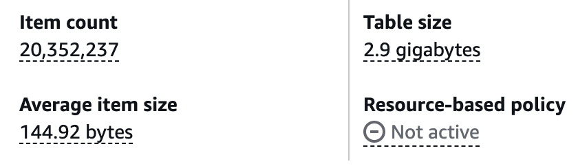
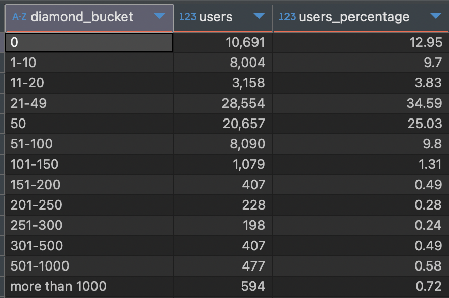
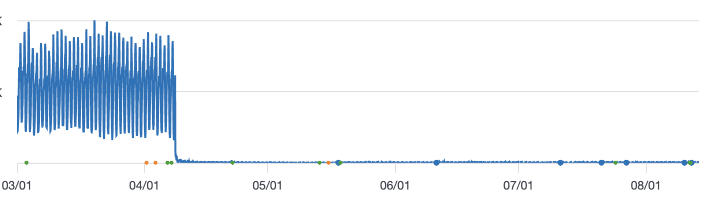

While leading engineering on [**Callbreak Legend**](https://bhoos.games/callbreak/) at [**Bhoos Games**](https://bhoos.games/), one of the major works I carried out was migrating the production database consisting of more than 20 million user items from DynamoDB to PostgreSQL.
The development of Callbreak Legend had begun in 2019 A.D led by one of the senior developer at Bhoos.
During the initial development, resources were limited so he chose to build everything using as many freely available resources as possible. To save time and start quickly, he chose DynamoDB for the database part of the project.

## Why was the migration necessary?
1. There were no indexes on keys of the database except for the id. So, executing any non-id query was both time-consuming and expensive.
2. Due to the time and cost prohibitive nature, there was no way to look for any insights and analytics of the data that we had stored about the users.
3. To save space, every field label was encoded to some characters. For someone looking at the database, they would have no clue what that gibberish is. A typical `Account` table item looked like this:  
    ```json
    {"id":{"S":"uXgZaTxZdxz5"},"$a$1":{"N":"1121"},"$a$2":{"N":"2506"},"$a$3":{"N":"750"},"$b$11b$5":{"N":"1"},"$b$14b$5":{"N":"1"},"$b$18b$5":{"N":"2"},"$b$19b$5":{"N":"1"},"$b$1b$5":{"N":"6"},"$b$22b$5":{"N":"2"},"$b$23b$5":{"N":"1"},"$b$24b$5":{"N":"1"},"$b$25b$5":{"N":"1"},"$b$26b$5":{"N":"2"},"$b$29b$5":{"N":"5"},"$b$2b$5":{"N":"5"},"$b$30b$5":{"N":"3"},"$b$31b$5":{"N":"1"},"$b$32b$5":{"N":"3"},"$b$33b$5":{"N":"3"},"$b$34b$5":{"N":"3"},"$b$35b$5":{"N":"2"},"$b$36b$5":{"N":"5"},"$b$3b$5":{"N":"6"},"$b$5b$5":{"N":"1"},"$b$6b$5":{"N":"1"},"$b$7b$5":{"N":"3"},"$b$9b$5":{"N":"1"},"$c$m0":{"N":"73"},"$f$10":{"N":"12"},"$f$11":{"N":"3"},"$f$12":{"N":"1"},"$f$13":{"N":"4"},"$f$14":{"N":"316.3"},"$f$15":{"N":"103"},"$f$16":{"N":"39"},"$f$17":{"N":"23"},"$f$18":{"N":"126"},"$f$20":{"N":"763"},"$f$21":{"N":"208"},"$f$22":{"N":"11"},"$f$23":{"N":"10"},"$f$24":{"N":"631"},"$f$25":{"N":"202"},"$f$5":{"N":"20"},"$g$t":{"N":"1775630912776"},"$r$10":{"N":"6"},"$r$11":{"N":"4"},"$r$12":{"N":"10"},"$r$13":{"N":"9"},"$r$14":{"N":"255.3"},"$r$15":{"N":"103"},"$r$16":{"N":"66"},"$r$17":{"N":"43"},"$r$18":{"N":"179"},"$r$20":{"N":"593"},"$r$21":{"N":"199"},"$r$22":{"N":"16"},"$r$23":{"N":"13"},"$r$24":{"N":"566"},"$r$25":{"N":"181"},"$r$27":{"N":"1"},"$r$5":{"N":"29"},"$r$7":{"N":"6"},"country":{"S":"np"},"name":{"S":"G-1663085"},"picture":{"S":"\"5\""},"type":{"S":"google"}}
    ```
    For your context, here `$a$1` is diamond, `$a$2` is coin, `$a$3` is XP and so on.

## Planning the Migration
For the initial migration phase, we decided to migrate the user and user accounts related data only, leaving behind games data. We migrated the `users` table as it was and for `accounts` table, the major attributes like diamonds, coins, XP, etc were modeled as columns and rest of the data (which basically were some stats of the players) was stored on a JSONB column named game_data. For example `$f$5` is how many singleplayer games that the player has played. Similarly, `$r$7` denotes how many multiplayer games that the player has won.

Here's how we shaped the accounts table for Postgres:
```sql
CREATE TABLE IF NOT EXISTS accounts (
id TEXT PRIMARY KEY,
name TEXT,
picture TEXT,
country TEXT,
type TEXT,
email TEXT,
diamond BIGINT NOT NULL DEFAULT 0,
coin BIGINT NOT NULL DEFAULT 0,
xp BIGINT NOT NULL DEFAULT 100,
game_data JSONB NOT NULL DEFAULT '{}',
updated_at TIMESTAMP WITH TIME ZONE DEFAULT now()
);
```

Since there were more than 20 million user items, it was unfeasible to carry out offline migration. Dumping all that data to S3 would take much time and bear cost, and also 20 million included the majority of dead accounts. Also, we would have had to shut the server down until the migration happened successfully.
Hence, we chose to do online migration. We hosted the Postgres(v16.1) db on an Amazon EC2 server alongside our other game database. We only spun a single instance as it was enough for us. For backup and analysis purpose we created a slave from the master.
<figure class="center-figure">
  
  <figcaption>DynamoDB Account table info</figcaption>
</figure>


## The actual migration process
For the migration to happen online with zero-downtime, we decided to do a simple check on our server endpoints. It worked as follows:
1. Server checks if user data is present in postgres db.
2. If yes, proceed execution based on that data.
3. If no, migrate data (copy user data from dynamoDB to PostgreSQL) and do the required execution.
4. We also added a fallback in case anything goes wrong. If migration fails for some reason, server would fall back to dynamoDB for the execution.

Since there were rapid changes and rework being done on Callbreak Legend, to speed up the migration process, I collaborated with one of my coworker to implement the Shim layer for migration, utilizing the Claude Hammer he had hoarded.

A data transformation layer was written to transform gibberish to gold (yes, quite literally). The decode layer turned `$a$1` to `diamond`, `$a$2` to `coin`, `$a$3` to `xp`, and so on.

When the user connected to our server the next time, we carried out what we call "The Lazy Migration Technique", migrating their data automatically to Postgres DB on first connection.

We thoroughly tested the migration process in our development server before deploying it to the production.
Now there was nothing left for us to do except track the row counts to monitor progress. I kept looking at the count of users who had migrated frequently to make sure everything was going right.

## Results
Queries that weren't possible previously, we could run freely afterwards. We unlocked the ultimate weapon to gather the insights we required from the user data that we possessed.
For example, the following query helped us figure out that most of our users lay in the lower diamond bucket range enabling us to make decisions to update our economy system to improve revenue growth, which I will cover in my upcoming blogs.
```sql
with diamonds as (
    select diamond
    from accounts
    join users u
    on u.account_id = accounts.id
    and u.id not like 'army/%'
),
bucket as (
    select diamond, 
        case when diamond = 0 then '0'
            when diamond > 0 and diamond <= 10 then '1-10'
            when diamond > 10 and diamond <= 20 then '11-20'
            when diamond >= 21 and diamond < 50 then '21-49'
            when diamond >= 50 and diamond <= 50 then '50'
            when diamond >= 51 and diamond <= 100 then '51-100'
            when diamond >= 101 and diamond <= 150 then '101-150'
            when diamond >= 151 and diamond <= 200 then '151-200'
            when diamond >= 201 and diamond <= 250 then '201-250'
            when diamond >= 251 and diamond <= 300 then '251-300'
            when diamond >= 301 and diamond <= 500 then '301-500'
            when diamond >= 501 and diamond <= 1000 then '501-1000'
            else 'more than 1000' end as diamond_bucket
    from diamonds
),
dist as (
    select diamond_bucket, count() as users
    from bucket
    group by diamond_bucket
)
select, round(users * 100 / sum(users) over (), 2) as users_percentage
from dist
order by diamond_bucket;
```
<figure class="center-figure">
  
  <figcaption>Diamond distribution of users</figcaption>
</figure>

## Lessons Learned
We missed several things on this migration process which made us suffer later.
1. We had decided not to delete any data from DynamoDB as a safeguard. But we missed to keep a simple flag on the DynamoDB whether a particular user item had successfully migrated or not. This would have simplified many things for us. Control flow hitting some edge cases and falling back to DynamoDB for execution caused us to re-look for any broken path.

<figure class="center-figure">
  
  <figcaption>Decline in DynamoDB read requests after migration</figcaption>
</figure>

2. We had reviewed the code written by Claude properly for the most part. Because the shim layer had the same pattern for every endpoint, we reviewed that everything should work correctly. But. But. But. A simple logical flaw in a shim layer for Account Deletion endpoint gave a way for any player to have unlimited resources. On my next article, I will write about how I cut debugging time by implementing structured logging which led to the detection of that anomaly.

## Conclusion
It was a great rollercoaster ride, and my first time leading a proper production database migration. But the real takeaway isn't the database - it's that an "impossible" migration is just a series of small decisions: keep the old system alive, migrate lazily, and never remove the fallback until you're sure. Today, the queries that used to cost us money and minutes run in milliseconds, and for the first time we could actually see how our players played.
